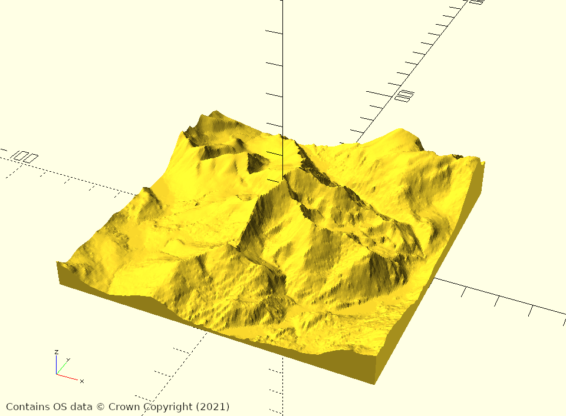

Ordnance Survey - The National Grid
===================================

The [Ordnance Survey National Grid](https://www.ordnancesurvey.co.uk/resources/maps-and-geographic-resources/the-national-grid.html)
is a coordinate system commonly used in the United Kingdom for mapping and
survey data.

The base `github.com/usedbytes/osgrid` package provides functionality for 
parsing, formatting and manipulating coordinates in the OS National Grid system
("grid references").

For example, the OS grid reference of the summit of Snowdon is `SH 60986 54375`.
We can find the OS grid reference for the point 300 metres East and 2 kilometres
North like so:

```
	summit, _ := osgrid.ParseGridRef("SH 60986 54375")
	point, _ := summit.Add(300 * osgrid.Metre, 2 * osgrid.Kilometre)
	fmt.Println(point.String())
```

## `osdata`

The Ordnance Survey make lots of their mapping data available for free under
[OS OpenData](https://osdatahub.os.uk/downloads/open).

Under `osdata` there are two packages for working with a subset of that data:

* [`terrain50`](osdata/terrain50): For accessing the OS [Terrain50](https://osdatahub.os.uk/downloads/open/Terrain50)
  dataset, which provides elevation data for the whole of the UK, with 50 m
  horizontal and 0.1 m vertical resolution.
* [`raster`](osdata/raster): For accessing raster-format data. This has only been tested with
  the [OS VectorMap District](https://osdatahub.os.uk/downloads/open/VectorMapDistrict)
  dataset at the time of writing.

Further details on how to use the packages can be found in their respective
directories.


## `cmd/osmodel`

[`osmodel`](cmd/osmodel) is a command-line application which uses the other packages in this
repository to generate different representations of the supported
[OS OpenData](https://osdatahub.os.uk/downloads/open).
datasets.

It has 3 subcommands:

* `surface`: Generate a "surface" from a specified region of an elevation dataset,
   e.g. as a CSV file.
* `texture`: Generate an image from a specified region of a `raster` dataset.
* `mesh`: Generate a 3D model, optionally with a texture, from a specified region
   of elevation and raster datasets. e.g. as an STL or X3D file, suitable for
   3D printing.




> Images above contains OS data © Crown Copyright (2021), used under the
> [Open Government License](http://www.nationalarchives.gov.uk/doc/open-government-licence/version/3/)
