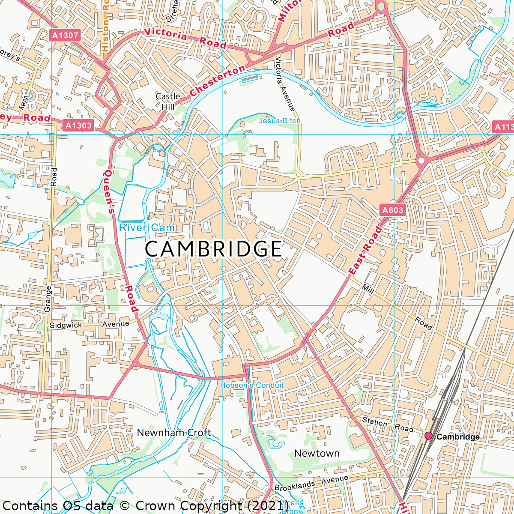
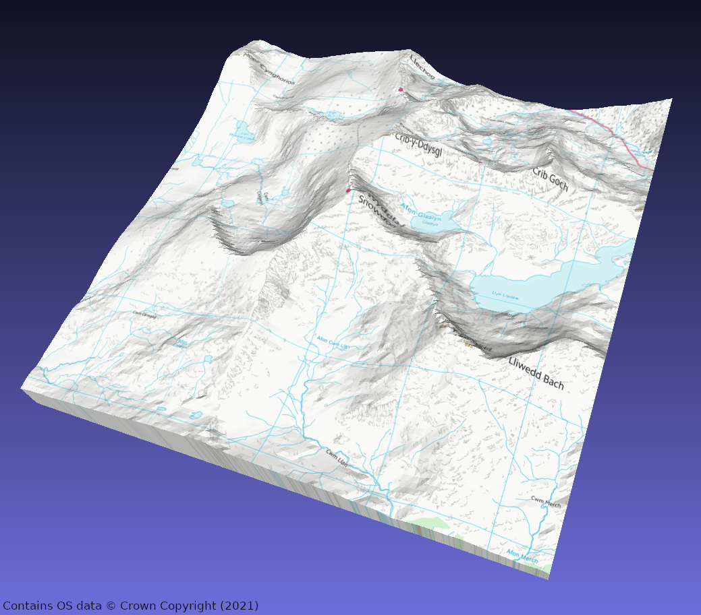
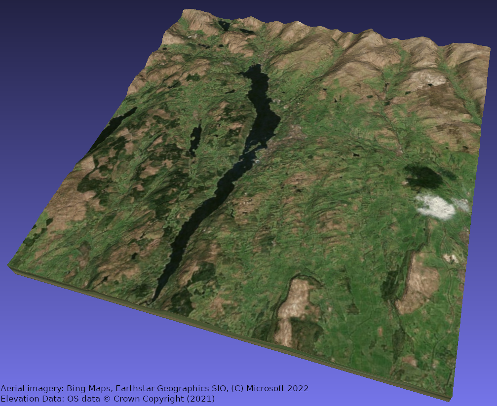

# `osmodel`

> Images on this page contains OS data © Crown Copyright (2021), used under the
> [Open Government License](http://www.nationalarchives.gov.uk/doc/open-government-licence/version/3/)

`osmodel` is a command-line application which uses the other packages in this
repository to generate different representations of the supported
[OS OpenData](https://osdatahub.os.uk/downloads/open).
datasets.

It has 3 subcommands:

* `surface`: Generate a "surface" from a specified region of an elevation dataset,
   e.g. as a CSV file.
* `texture`: Generate an image from a specified region of a `raster` dataset.
* `mesh`: Generate a 3D model, optionally with a texture, from a specified region
   of elevation and raster datasets. e.g. as an STL or X3D file, suitable for
   3D printing.

## Getting started

Make sure you have `go` installed, any recent version should work (1.14+ maybe?)

### Build/install

Either:

* Clone this repository
* `cd osgrid/cmd/osmodel`
* `go get .`
* `go build .`
* Run `./osmodel`

Or:

* Run `go install -v github.com/usedbytes/osgrid/cmd/osmodel@master`
* Run `osmodel`, assuming your go binary directory is on your $PATH

### Get some data

Go to
[OS OpenData](https://osdatahub.os.uk/downloads/open).
and download some data.

For elevation data, get
[_Terrain 50_, "ASCII Grid"](https://osdatahub.os.uk/downloads/open/Terrain50).

For raster data, I've used
[OS VectorMap District](https://osdatahub.os.uk/downloads/open/VectorMapDistrict),
"GeoTIFF Full Colour" successfully.

Extract each of the zip files into their own directory and point the
`--elevation` and/or `--raster` flags to those directories, _which should
*contain* a folder called `data`_.

## `surface` subcommand

The `surface` subcommand just outputs elevation data, using the
[`terrain50`](../../osdata/terrain50)
package.

It can output to different text-based formats, like `.csv`, `.tsv`, and also has
a `.dat` output (just space-separated data) which is suitable for use with
[OpenSCAD's](https://openscad.org/) `surface()` command. Note however, that for
3D modelling applications, the `mesh` command below is a better option.

It can also output to a greyscale PNG image (ligher color --> higher elevation),
also usable with OpenSCAD's `surface()` command.

The `--srgb` flag applies the sRGB transfer function to image outputs, making
them better for "viewing", but useless for use as a data format, because the
values become non-linear.

By default (except for image formats), the surface data is exported South ->
North, so the first row of values represents the Southern-most part of the
region. This can be changed with the `--flip` option.

The `--hres` option allows setting a (lower) resolution for the elevation data,
which is useful for reducing the number of data points for exporting large
areas.

The `OSMODEL_ELEVATION_DB` environment variable can be set to the elevation
data directory, or it can be passed as the `--elevation` argument

Example usage:

Output a viewable PNG representing a 5 km * 5 km area around Cheddar Gorge

```
./osmodel surface --elevation ~/data/terrain50 --srgb -w 5000 -o cheddar.png ST 46697 53996

```


## `texture` subcommand

The `texture` subcommand outputs raster images, using the
[`raster`](../../osdata/raster)
package.

The `OSMODEL_RASTER_DB` environment variable can be set to the raster
data directory, or it can be passed as the `--raster` argument

Example usage:

Output a 3 km area around the centre of Cambridge

```
./osmodel texture --raster ~/data/vectormap -w 3000 -o cambridge.png TL 45201 58287
```



### Known issue:

> Note that this impacts the Cambridge example above!

The `golang.org/x/image/tiff` package which is used for decoding the TIFF images
has an issue where it throws "unexpected EOF" for some images. For example tile
`NO08` exhibits this problem.

I've posted a patch which appears to fix it:
https://github.com/golang/go/issues/30827#issuecomment-774469551

I probably should either make a vendored version of that module and pin it in
this package, or try out a different TIFF decoder package.

## `mesh` subcommand

The `mesh` subcommand is the primary purpose of this repository - it can
generate 3D models suitable for 3D printing.

It supports writing to STL and X3D files, as well as generating OpenSCAD
`polyhedron()` code (though the files end up being quite big!).

The `--hscale/-H` and `--vscale/-V` flags allow you to set a scale for
horizontal and vertical directions respectively; by default they are set to
give 1 cm per km horizontally, and 2 cm per km vertically, assuming the output
files units are 1 mm.

In the case of X3D, it can also generate a "texture" from `raster` data and apply
it to the mesh, these can then be printed in full colour on an appropriate
machine - I have done this successfully using
[Shapeways' full colour sandstone](https://www.shapeways.com/materials/sandstone).

Example usage:

Generate a textured X3D model of the area around Snowdon's summit:

```
./osmodel mesh --elevation ~/data/terrain50 --raster ~/data/vectormap --texture -V 1:100 -o snowdon.x3d
```



### Aligning with "other" imagery

The
[OS OpenData](https://osdatahub.os.uk/downloads/open).
raster datasets are great, but real aerial imagery is even
better.

I haven't found a freely/easily available source of aerial imagery to
integrate directly with this tool.

However, if permitted by the terms of service of any of the free online mapping
sites with aerial imagery, it would be theoretically possible to generate a
texture image using `--texture`, manually line that up with a screenshot of
some aerial imagery, and replace the texture image file.

I am not a lawyer, but my reading of Bing's
[Print Rights](https://www.microsoft.com/en-us/maps/product/print-rights)
would allow this for personal use.

Here is a textured model of the area around Bowness-on-Windermere made using
this technique.



> Aerial imagery courtesy of Bing Maps, Earthstar Geographics SIO,
> (C) Microsoft 2022 
